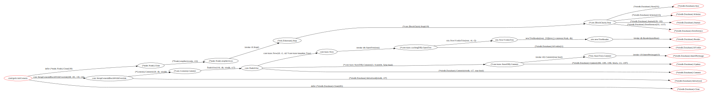

<div align="center">

<h1 align="center">go-callflow-vis</h1>

English / [简体中文](README_zh.md)

<p align="center"><b>go-callflow-vis</b> is a Go efficiency tool for analyzing and visualizing the reachability and call flow</p>

<p align="center">among functions belonging to different layers of a software architecture.</p>

## Core Concepts

One of the core concepts of go-callflow-vis is the call hierarchy.

This tool allows you to designate core functions for each layer, including the functions or a class of functions that should be included in each call level.

## Features

Multi-level bipartite graph output: Displays the reachability between functions in adjacent layers, including the possible call paths between two reachable functions.

Flexibility: Allows users to customize the key functions or function categories for each layer for more precise analysis of the project structure.

Visualization: Assists developers in identifying and optimizing code structure through visualized call paths.

## Installation

```shell
go install github.com/laindream/go-callflow-vis@latest
```

## Usage

Here, we use the analysis of [go-ethereum](https://github.com/ethereum/go-ethereum) as an example (see the [example](example) directory for details).

- **Writing Configuration File**

Suppose you want to quickly analyze the call relationship to the MPT (Merkle Patricia Trie) DB during the creation of the genesis block in go-ethereum, you can write the configuration file as follows ([example.toml](example.toml) introduces how to make detailed configurations):

```toml
# file:init_genesis_analysis.toml

# package_prefix is for trimming the function name in graph for human readability
package_prefix = "github.com/ethereum/go-ethereum/"


# layer is a set of matched functions used to generate flow graph. layers must be defined in order.
[[layer]]
name = "CMD Layer"
[[layer.entities]]
# match rule for the function name
# there are match type: "contain", "prefix", "suffix", "equal", "regexp", default to use "equal" if not set type
# can set exclude = true to exclude the matched functions
name = { rules = [{ type = "suffix", content = "initGenesis" }] }


[[layer]]
name = "DB Layer"
[[layer.entities]]
name = { rules = [{ type = "contain", content = "triedb.Database" }] }
```

- **Starting the Analysis**

Next, assuming you have downloaded the source code of go-ethereum and installed go-callflow-vis; then, entering the cmd/geth directory, you can start the analysis with the following command (see the quick script in [go_eth_example.sh](example/go_eth_example.sh)):

```shell
# run go-callflow-vis directly to see detailed command usage
go-callflow-vis -config init_genesis_analysis.toml -web .
```

- **Viewing the Analysis Results**

If everything goes well, you will be able to see your browser pop up and display the visualized and interactive analysis results.

In addition, the program will output the analysis call graph([dot file](example/graph_out)) and the call chain list([csv file](example/path_out)), default location: `./graph_out` and `./path_out` .

You can also obtain visualized svg files from the call graph's dot files (requires installing [graphviz](https://graphviz.org/)).

Run the following command in the graph_out directory:

```shell
dot -Tsvg -o complete_callgraph.svg  complete_callgraph.dot
dot -Tsvg -o simple_callgraph.svg  simple_callgraph.dot
```

You will be able to see two versions of the call graph, the complete version and the simplified version.

Complete version:



Simplified version:


