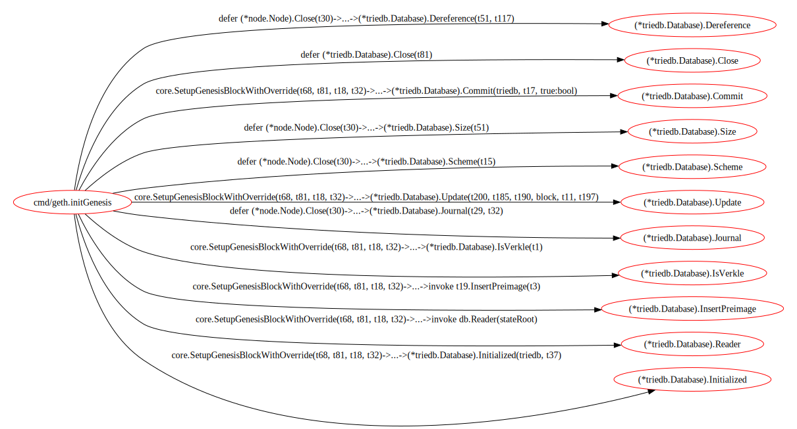

## go-callflow-vis

go-callflow-vis是一个命令行工具,专为分析Golang项目中指定函数的调用关系而设计.它通过分析代码来识别不同层级之间的函数调用关系,并生成一个多层二分图,从而帮助开发者理解和优化他们的代码结构.

#### 核心概念

go-callflow-vis的一个核心概念是调用层级.

此工具允许你指定每一层的核心函数,包括每个调用层级中需要包含的函数或一类函数.

#### 特性

多层二分图输出: 显示相邻层函数之间的可达性,包括两个可达函数之间的可能调用路径.

灵活性: 允许用户自定义每一层的关键函数或函数类别,以便更精确地分析项目结构.

可视化: 通过可视化调用路径,帮助开发者识别和优化代码结构.

#### 安装

```shell
go install github.com/laindream/go-callflow-vis@latest
```

#### 使用

这里我们以对[go-ethereum](https://github.com/ethereum/go-ethereum)的分析为例(详情见[example](example)目录).

**编写配置文件**

假设你想要快速分析go-ethereum中创建创世区块时对MPT(Merkle Patricia Trie)DB的调用关系,你可以如下编写配置文件([example.toml](example.toml)中介绍了如何进行详细配置):

```toml
# file:init_genesis_analysis.toml

# package_prefix is for trimming the function name in graph for human readability
package_prefix = "github.com/ethereum/go-ethereum/"


# layer is a set of matched functions used to generate flow graph. layers must be defined in order.
[[layer]]
name = "CMD Layer"
[[layer.entities]]
# match rule for the function name
# there are match type: "contain", "prefix", "suffix", "equal", "regexp", default to use "equal" if not set type
# can set exclude = true to exclude the matched functions
name = { rules = [{ type = "suffix", content = "initGenesis" }] }


[[layer]]
name = "DB Layer"
[[layer.entities]]
name = { rules = [{ type = "contain", content = "triedb.Database" }] }
```

**开始分析**

接下来,假设你已经下载了go-ethereum的源码,并且已经安装了go-callflow-vis;那么进入cmd/geth目录,你可以通过以下命令开始分析:(快速脚本见:[go_eth_example.sh](example/go_eth_example.sh))

```shell
go-callflow-vis -config init_genesis_analysis.toml -web .
```

**查看分析结果**

如果一切正常,那么你将能够看到你的浏览器弹出并显示可视化可交互的分析结果.

此外,程序还会输出分析调用图([dot文件](example/graph_out))和调用链列表([csv文件](example/path_out))(默认位置./graph_out和./path_out).

你也可以通过调用图的dot文件得到可视化的svg文件(需要安装[graphviz](https://graphviz.org/).)

在graph_out目录下运行如下命令:

```shell
dot -Tsvg -o complete_callgraph.svg  complete_callgraph.dot
dot -Tsvg -o simple_callgraph.svg  simple_callgraph.dot
```

你将可以看到两个版本的调用图,完整版和简化版.

完整版:


简化版:


