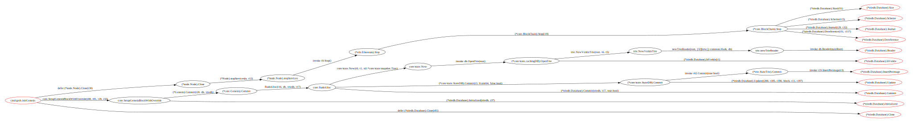
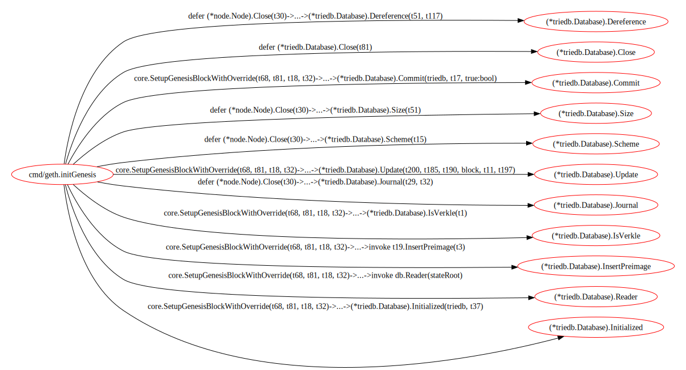

<div align="center">


<h1 align="center">go-callflow-vis</h1>

[English](README.md) / 简体中文

<p align="center"><b>go-callflow-vis</b>是一个用于分析和可视化复杂软件架构层级的工具</p>

---

</div>

## 介绍

传统的静态分析工具(如[go-callvis](https://github.com/ondrajz/go-callvis))输出项目中全部的调用关系; 面对复杂的项目, 结果往往是一团乱麻, 难以辨认, 失去实际的使用价值. 相比之下, go-callflow-vis提供了一种更加精细和可控的方式来分析复杂软件的架构层级.

go-callflow-vis允许用户自定义一系列有序的调用层级(例如在一个典型的Web项目中, 这些层级可能是API->Operator->Manager->DAO), 并且可以通过配置文件指定每一层的关键函数或函数类别; go-callflow-vis能够分析并可视化这些层级函数之间的可达性与调用流，对于相邻层级的两个可达的函数，go-callflow-vis只给出一条示例路径避免整个调用图过于复杂，而函数间的可达性是完全正确的。

## 特性

- **按层级输出调用流**: 聚焦相邻层级函数之间的可达性与调用流, 避免结果过于复杂.

- **灵活配置**: 允许用户自定义每一层的关键函数或函数类别, 更精确地分析项目结构.

- **可视化与交互**: 提供良好的可交互的可视化结果, 更直观地帮助开发者了解与优化代码结构.

## 安装

```shell
go install github.com/laindream/go-callflow-vis@latest
```

## 使用

这里我们以对[go-ethereum](https://github.com/ethereum/go-ethereum)的分析为例(详情见[example](example)目录).

- **编写配置文件**

假设你想要快速分析go-ethereum中创建创世区块时对MPT(Merkle Patricia Trie)DB的调用关系, 你可以如下编写配置文件([example.toml](example.toml)中介绍了如何进行详细配置):

```toml
# file:init_genesis_analysis.toml

# package_prefix is for trimming the function name in graph for human readability
package_prefix = "github.com/ethereum/go-ethereum/"


# layer is a set of matched functions used to generate flow graph. layers must be defined in order.
[[layer]]
name = "CMD Layer"
[[layer.entities]]
# match rule for the function name
# there are match type: "contain", "prefix", "suffix", "equal", "regexp", default to use "equal" if not set type
# can set exclude = true to exclude the matched functions
name = { rules = [{ type = "suffix", content = "initGenesis" }] }


[[layer]]
name = "DB Layer"
[[layer.entities]]
name = { rules = [{ type = "contain", content = "triedb.Database" }] }
```

- **开始分析**

接下来, 假设你已经下载了go-ethereum的源码, 并且已经安装了go-callflow-vis; 那么进入cmd/geth目录, 你可以通过以下命令开始分析(快速脚本见[go_eth_example.sh](example/go_eth_example.sh)):

```shell
# run go-callflow-vis directly to see detailed command usage
go-callflow-vis -config init_genesis_analysis.toml -web .
```

- **查看分析结果**

如果一切正常, 那么你将能够看到你的浏览器弹出并显示可视化可交互的分析结果.

此外, 程序还会输出分析调用图([dot文件](example/graph_out))和调用链列表([csv文件](example/path_out)), 默认位置: `./graph_out` 和 `./path_out` .

你也可以通过调用图的dot文件得到可视化的svg文件(需要安装[graphviz](https://graphviz.org/)).

在graph_out目录下运行如下命令:

```shell
dot -Tsvg -o complete_callgraph.svg  complete_callgraph.dot
dot -Tsvg -o simple_callgraph.svg  simple_callgraph.dot
```

你将可以看到两个版本的调用图, 完整版和简化版.

完整版:



简化版:


